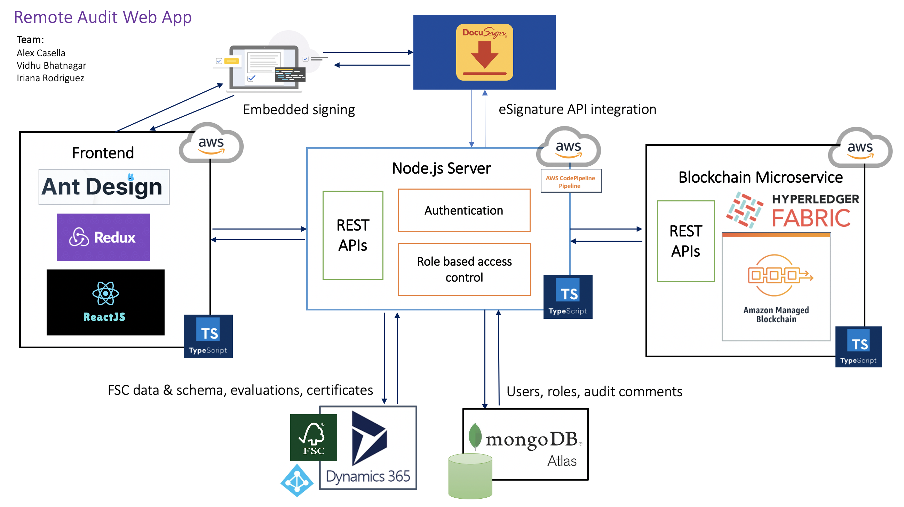
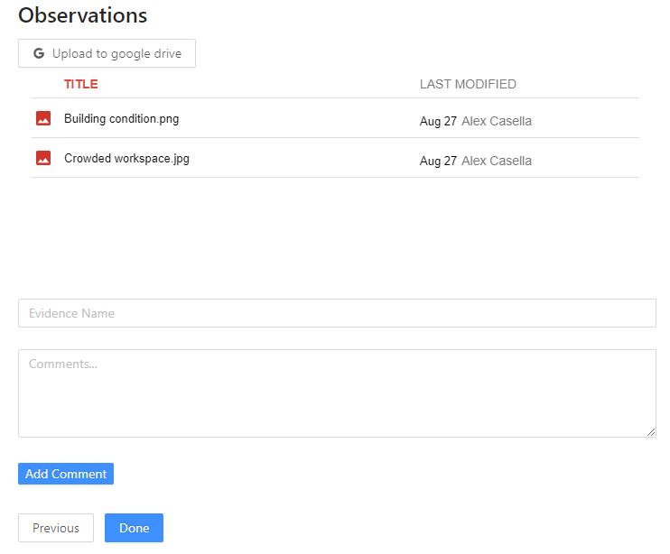
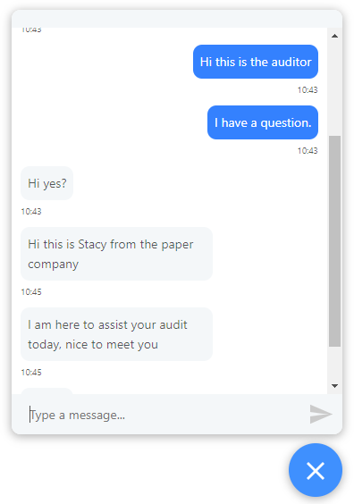
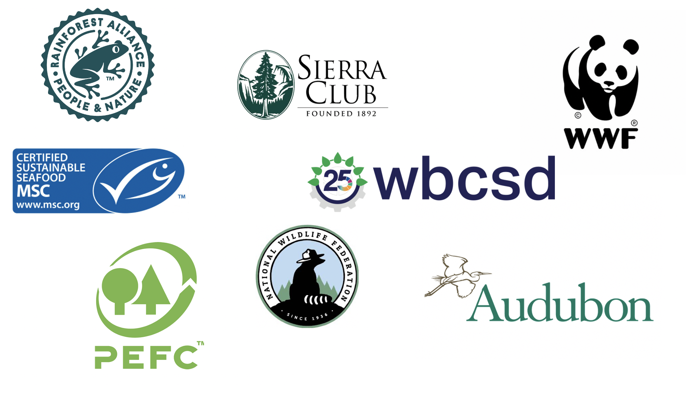

# Docusign FSC Hackathon Submission

## App 3 - Greeblocks

## Team members:

**Alex Casella** (axc@bu.edu): Team captain, architect, backend & blockchain developer

**Vidhu Bhatnagar** (vidhu@bu.edu): Frontend developer

**Iriana Rodriguez** (irianar@bu.edu): Storyteller and researcher

## Overview

Forest products are all around us — from our pencils and papers, to our furniture and flooring, and much more. We want to help the Forest Stewardship Council (FSC) and Docusign work as hard for our forests, as the forests work for us.

Unfortunately, the Coronavirus has made it difficult for the FSC certification body (CB) to provide a chain of custody certification for companies in the forest industry supply chain. Specifically, it has become harder for FSC to conduct onsite audits of these companies, which is crucial in the pursuit of deciding what makes an ethical forest industry. To resolve this problem, we have built a web application that enables FSC auditors to virtually audit CoC applicants and issue these certifications. In addition, we have built a blockchain microservice to keep track of certifications with an immutable ledger. Let’s bring people who love forests together and help make today’s decisions work for tomorrow’s world.

From the forest to the end customer, our app can be used by all companies in its supply chain.

:evergreen_tree::evergreen_tree::evergreen_tree: :arrow_right: Harvesting :arrow_right: Manufacturer :arrow_right: Broker :arrow_right: Distributer :arrow_right: Printer :arrow_right: Wholesaler :arrow_right: Retailer :arrow_right: :family:

## Technical architecture



## Frontend UI

The frontend UI is built with React, Redux, and Ant Design. When a user first logs in, they enter a guided walkthrough of the certification process. Our interface supports multiple user roles (Applicant, CB, FSC, ASI). Each roles correspond to a different walkthrough experience tailored based on their permissions and needs. Data is persisted through the backend REST API server.

### Authentication and Authorization

User login is done by exchanging their credentials for a JWT token from the backend server. This JWT token is signed by an asymmetric key and encodes information including user's email and role.

```
{
  "user": {
    "id": "5f48737f8968a481770ab4df",
    "email": "cb@cb.org",
    "name": "Tom",
    "role": "CB"
  },
  "iat": 1598755434,
  "exp": 1630291434
}
```

The token is decoded to facilitate Role Based Access Control.

### Docusign and OAuth2

OAuth2 is used to make request to Docusign on behalf of a user. This is used to generate embedded signing ceremonies.

OAuth code and token exchange is facilitated by proxying requests through the backend server. When the token is received by the frontend, it is saved in the browser's local storage and refreshed when it's expired.

### Google Drive Integration

A google drive folder is used to upload evidences and observations which are then evaluated by the auditor. This folder is embedded and integrated in the UI's observation step.

### Evaluations

Evaluations allow the auditor to comment on observations. This data is persisted in Dynamics' evaluation schema. Every evaluation has a date, subject (observation) and the related certificate which the observation is part of.

CRUD operations on the evaluations schema are proxied through the backend server.



### Live Chat

Our live chat feature allows different parties to communicate with each other in a unified chat interface. This allows conversations to be scoped to the certification in progress.

This is implemented using long polling which is what allows real time chat to take place. Periodically the UI polls the backend to check if any new messages are available. The chat component keeps track of whether a message was sent by the current user or by a different user, and uses this information to visually distinguish different messages.



## Backend server

Our backend server is built with Node.js and Express. We have written our server side code in Typescript for the ability to do static type checking and less error prone code.

The server stores FSC data & schema, evaluations, and certificates to Microsoft Dynamics 365. Evaluations and certificates follow the required FSC schema. In addition, the server stores user info, roles, and audit comments to MongoDB Atlas.

The server exposes the following **15 REST APIs**, consumed by our UI. The decoupling of server and UI is beneficial because we can scale up the server without impacting the UI, and the UI can be swapped out as needed.

```
Register user
POST api/user/

Get all registered users
GET api/user/

Login and authenticate
POST api/auth/

Get logged in user
GET api/auth/

Get all organizations from MS Dynamics CRM
GET api/org/

Add a new certificate to MS Dynamics. When the blockchain microservice is enabled this will add a certificate to the ledger as well
POST api/certificate/

Update an existing certificate's status to "Issued" in MS Dynamics. When the blockchain microservice is enabled this will update the certificate in the ledger as well
POST api/evaluation/certificate/:certificateID

Get all certificates from MS Dynamics
GET api/certificate/

Add a new evaluation for a certificate to MS Dynamics. Evaluations are only visible to FSC, ASI, and CB
POST api/evaluation/

Get all evaluations for a certificate from MS Dynamics
GET api/evaluation/certificate/:certificateID

Add a feedback comment for a certificate, comment is visible to CoC applicant
POST api/certificate/:certificateID/add_comment

Get all feedback comments for a certificate
GET api/certificate/:certificateID/comments

Get Docusign access token with authorization code
GET api/docusign/token

Get embedded signing URL for FSC Trademark License Agreement
POST api/docusign/agreement

Get embedded signing URL for FSC Certificate Template
POST api/docusign/final_certificate
```

We have also added an authentication middleware for role based access control of our APIs. Roles can be "CB", "FSC", "ASI", or "Applicant". The following is achieved:

- Only a CB auditor can add an evaluation comment. These evaluations are only visible to CB, FSC, and ASI.
- Only a CB auditor can issue a certificate and update a certificate.
- Both the CB auditor and the CoC applicant can chat freely on evidences. As shown in the chat box feature of our UI.

In addition, we have integrated with DocuSign's eSignature APIs. The CoC applicant is required to sign the FSC Trademark License Agreement and the CB auditor is required to sign the FSC Certificate using embedded signing ceremonies.

For our demo, the server is deployed to AWS.

## Blockchain microservice

Simply relying on an centralized database such as Microsoft Dynamics isn't enough. We have decided to take advantage of blockchain technology and add an immutable source of truth for each certificate issued by the FSC.

Our blockchain microservice is built on top of Hyperledger Fabric. Hyperledger Fabric is an open source private permissioned blockchain framework. The microservice's server is built with Node.js and Express. The server side code is written in Typescript. The server calls Hyperledger Fabric's Contract APIs to communicate with the blockchain network.

The smart contract chaincode is written in Typescript as well. It is ready to be hosted on a managed blockchain service such as the Amazon Managed Blockchain service.

Certificate object in the blockchain ledger:

```
@Object()
export class Certificate {
  @Property()
  public certificateID: string;
  public type: string;
  public company: string;
  public issuer: string;
  public issuanceDate: string;
  public status: string;
}
```

The microservice server exposes **REST APIs**, called by the backend server:

```
Add a certificate to the blockchain ledger
POST api/blockchain/certificates
```

We have made it optional for the backend server to connect to the blockchain microservice. In the backend server, the config setting is the `enable_blockchain` field in `src/config/config.ts`. After the chaincode is deployed to a managed blockchain service, this option can be turned on, and the microservice's server can be started. When this is enabled, the backend server can call the `POST api/blockchain/certificates` API when updating the certificate's status to "issued" in Microsoft Dynamics. This creates a certificate in the immutable ledger.

## Greater good

We believe our app and architecture can be easily customized and adopted by other non-profit organizations, especially ones that contribute to the conservation and restoration of forest, land, water, and air.



## What's next for this project

We are proud to have gotten this far in our spare time in 2 months. However, there are a few improvements to be made if the FSC would like to use it in production.

- On the frontend, implement a more seamless integration with google drive which allows users to drag and drop files, and directly add evaluations in the form of annotations in the file view.
- Since there are multiple actors in this certification process, use of notifications and email alerts would help make the process more efficient.
- Deploy the smart contract chaincode to a managed service.
- Add additional features to the smart contract to allow more companies in the supply chain to participate.
- Enhance authentication and restrict access to blockchain microservice APIs.

Thank you Docusign and FSC for the opportunity to learn, give back, and compete in this hackathon.

:deciduous_tree::deciduous_tree::deciduous_tree::deciduous_tree::deciduous_tree:

## Try it out

Our UI is live at: http://docusignfsc.s3-website-us-east-1.amazonaws.com/login

Auditor:
Email (case sensitive): cb@cb.org
Password: password

CoC company representative:
Email (case sensitive): Applicant@tree.org
Password: password

### Local environment

To start the UI:

```
cd frontend_app
tsc
npm install
npm run start
```

To start the backend server

```
npm install
npm run server
```

Checkout our demo video on [Youtube](https://www.youtube.com/watch?v=NoS7zAkZ2Gc&feature=youtu.be)!
