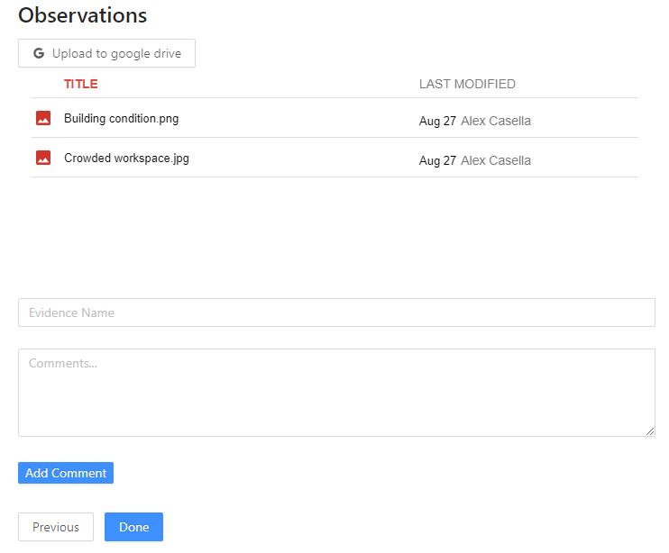

# Docusign FSC Hackathon UI

## Overview

This is the UI for our App 3 project. When a user first logs in, they enter a guided walkthrough of the certification process.

The system supports multiple user roles (Applicant, CB, FSC, ASI). Each roles is given a different walkthrough experience tailored based on their needs and permissions.

Data is communicated through and persisted by the backend REST API server

## Features and Technologies Used

### Authentication and Authorization

User login is done by exchanging their credentials for a JWT token from the backend server. This JWT token is signed by an asymmetric key and encodes information including user's email and role.

```
{
  "user": {
    "id": "5f48737f8968a481770ab4df",
    "email": "cb@cb.org",
    "name": "Tom",
    "role": "CB"
  },
  "iat": 1598755434,
  "exp": 1630291434
}
```

The token is decoded to facilitate Role Based Access Control

- Applicant Role
  - Allowed to sign FSC Trademark License Agreement
  - Not allowed to view auditor evaluation comments to the FSC and ASI
  - Not allowed to sign FSC Certificate
- Certification Board Role
  - Allowed to view and add evaluations
  - Allowed to sign FSC Certificate
  - Not allowed to sign FSC Trademark License Agreement
- FSC and ASI roles
  - Not allowed to sign FSC Trademark License Agreement
  - Allowed to view auditor evaluation comments
  - Not allowed to sign FSC Certificate

### Docusign OAuth2

OAuth2 is used to make request to Docusign on behalf of a user. This is used to generate embedded signing ceremonies for the appropriate recipients.

OAuth code and token exchange is facilitated by proxying requests through the backend server. When the token is received by the frontend, it is saved in the browser's local storage and refreshed when it's expired.

### Google Drive Integration

A google drive folder is used to upload evidences and observations which are then evaluated by the auditor. This folder is embedded and integrated in the UI's observation step.

### Evaluations

Evaluations allow the auditor to comment on observations. This data is persisted in Dynamics' evaluation schema. Every evaluation has a date, subject(observation) and related certificate that the observation is part of.

CRUD operations on the evaluations schema are proxied through the backend application via a RESTful interface.



### Live Chat

The live chat allows different parties to communicate with each other in a unified chat interface. This allows conversations to be scoped to the certificate thats in progress.

This is implemented using long polling which is the what allows the real time chat to take place. Periodically the UI polls the backend to check if any new messages are available. If yes, then they are rendered in the UI. The chat component is aware of whether a message was sent by the current user or by a different user, and uses this information to visually distinguish different messages.


## Further Improvements

There are a lot of areas that this PoC can be improved on

- We'd like to implement a more seamless integration with google drive which allows users to drag and drop files and add evaluations in the form of annotations directly in the file view

- Since there are multiple actors in this certification process, use of notifications and email alerts would help make the process more efficient
